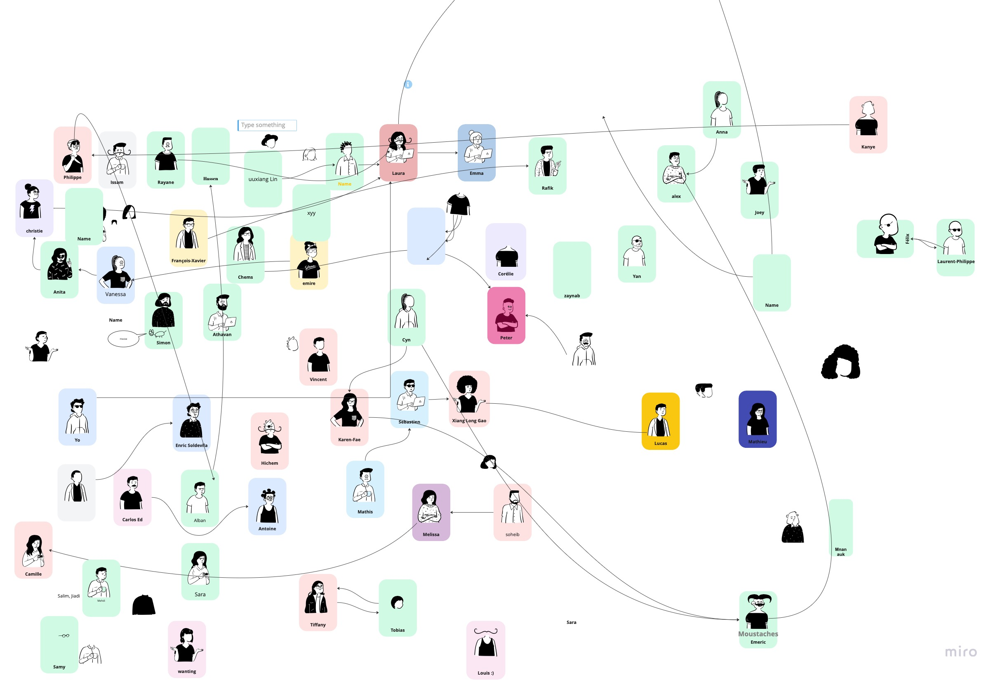
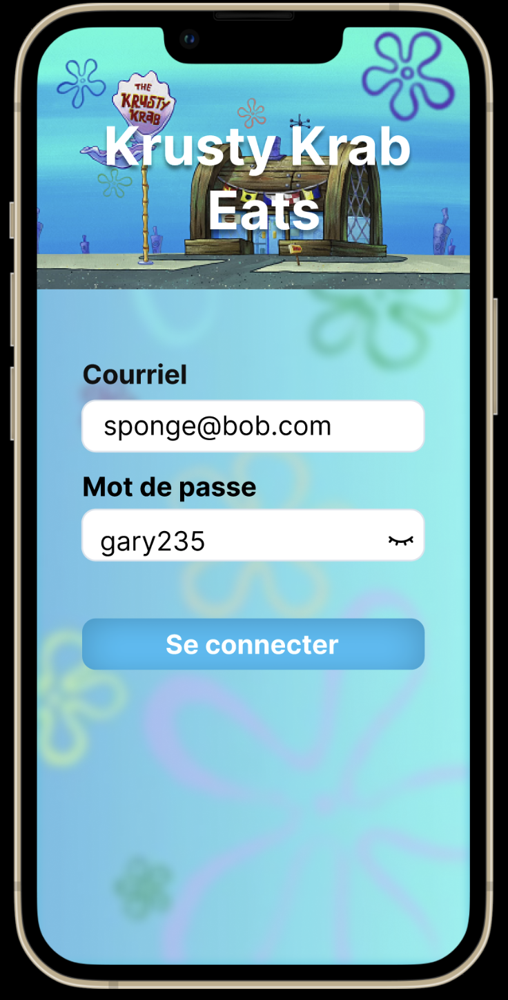
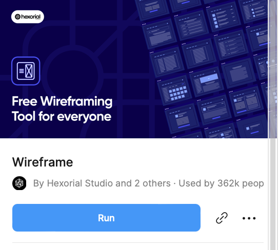
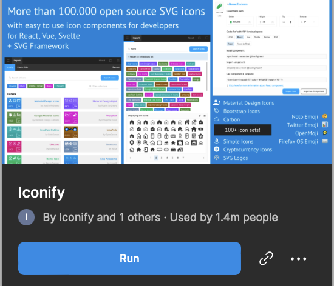

## IFT2905 - Introduction 

## Liens rapides

#### Tutoriels de 15 minutes de ce que nous avons vu en classe*:

* [Tutoriel miro (français)](https://www.youtube.com/watch?v=nL6PzwKC9Qc)
* [Tutoriel figma (français)](https://www.youtube.com/watch?v=M0xkv7Sqtc0)

* [Tutoriel wireframe sur Miro](https://www.youtube.com/watch?v=mQHMQYqUC_8) (anglais, plus complet) 
* [Tutoriel intro figma](https://www.youtube.com/watch?v=jk1T0CdLxwU) (anglais, plus complet)

*Note: ceux en anglais sont plus pertinents pour ce que nous avons vu. 

## Plan de la démo

> 1. Présentation générale 
> 2. Nous contacter, dispos 
> 3. TLDR: le cours, pourquoi?
> 4. Intro MIRO 
> 5. Intro Figma 

## 1. Présentation générale + précisions

### À propos de moi 

* Laura Salas
* Dernière session 
* Donné le labo pour quelques un.e.s d'entre vous pour H2022 - Web
* Ceux et celles qui ne m'ont jamais eue comme démo: j'aime beaucoup les chats et bob l'éponge et vous le verrez dans mes démos 
* J'aime beaucoup le front-end, mais j'apprécie énormément le back-end. 
  * Veux travailler en tant que développeuse full stack après le bac 
  * Si jamais vous voulez parler de stages, projets personnels, etc., soyez les bienvenu.e.s à me venir me voir :-) 
* J'apprécie et favorise vraiment des approches **pratiques** pour apprendre (!)

### À propos de nos démos pour le cours 

* Partagées entre Vincent et moi, en alternance d'une semaine à l'autre (normalement). 
* *Normalement* se donneront dans 1 seul local avec les deux groupes: **nous vous donnerons plus de détails sur studium. Jusqu'à ce qu'on vous dise autrement, venez au local Y115 avec moi **
* Mélange de revoir quelques parties de la théorie, et l'appliquer 

## 2. Important: Contacter les démos + disponibilités à venir

## ==Utiliser le forum sur Studium pour les questions générales pour éviter la répétition svp :)== 

### Pour les questions privées et sujets importants: 

## laura.elisa.salas@umontreal.ca  + "IFT2905" dans le sujet!! 

### Dispos à Vincent et moi: 

Nous allons vous passer un lien pour rentrer vos disponibilités bientôt.  

## 3. TLDR: Le cours, pourquoi?

#### Selon moi, ce cours vous est pertinent pour: 

* Les bases du UI/UX 

  * ==Oui, même pour ceux et celles qui sont moins partant.e.s pour le front-end :-)==
  * Ceci inclut:
    * Le software (le logiciel)
    * Le hardware (la robotique, les interfaces avec plusieurs boutons, les machines manipulables par l'humain comme les autos, etc.)
    * Les choses non-tech qui impliquent une interaction avec les humains. Ex: [Norman Doors!](https://www.youtube.com/watch?v=yY96hTb8WgI)

* **Beaucoup** mieux comprendre l'utilisateur 

  * ==Incluant ceux et celles qui aiment rire de l'utilisateur qui ne comprend pas votre interface :-)==

* Avoir un aperçu du rôle, des objectifs et des points de vue de certains non-programmeurs dans votre équipe/votre compagnie, en industrie. 

* Vous rendre un meilleur développeur (oui, vraiment)

  

## 4. Intro Miro

### Pourquoi Miro?

Outil de collaboration en équipe, **<u>vraiment</u>** bien fait. Comme un tableau géant intéractif. 

## Board demo miro vu en cours:

# [**http://tiny.cc/intromiro**](http://tiny.cc/intromiro)

#### Collage fait par ceux présents: 

## Concept important à retenir: 

[Wireframing](https://www.experienceux.co.uk/faqs/what-is-wireframing/)

## 5. Intro Figma

### Concepts importants: 

* Figma vs. Miro 
* Les plugins, les librairies
* Interface de Figma 
* Niveau de détail attendu dans le cours (!)

### Board démo figma vu en cours:

# [**http://tiny.cc/introfig**](http://tiny.cc/introfig)

[Voir le prototype interactif de Krabby Patty Eats](https://www.figma.com/proto/wx92Lod8cyQLKA44p71DgC/Intro-Figma?node-id=16%3A46&scaling=scale-down&page-id=0%3A1&starting-point-node-id=9%3A14&show-proto-sidebar=1)

### Plugins recommandés (même nécessaires pour les devoirs)

