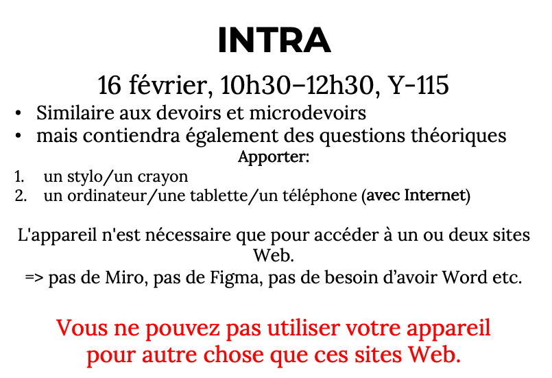
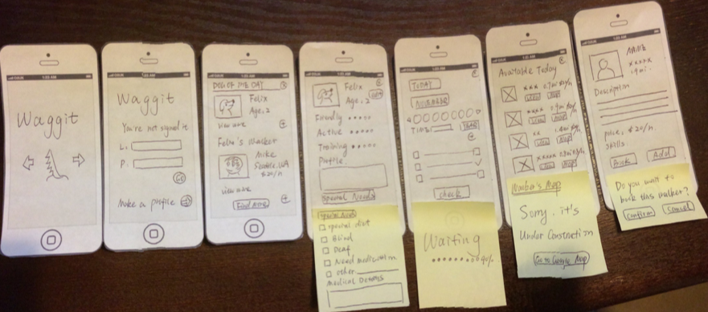
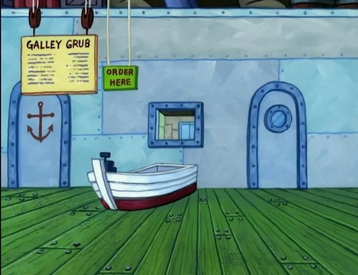
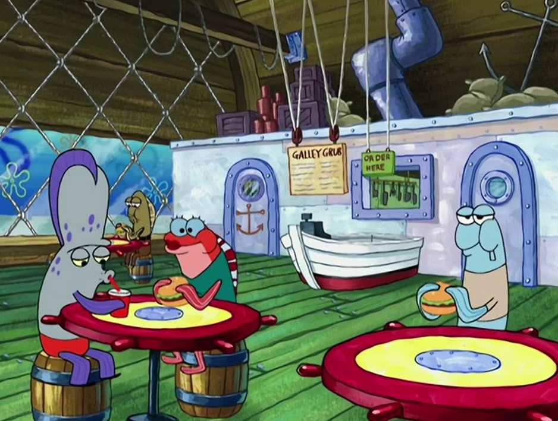
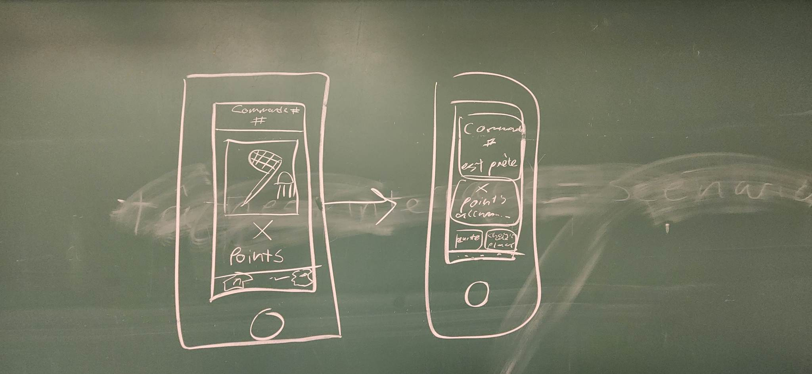

## IFT2905 - Semaine 5  - ✨  L'étudiant.e en IFT2905 entrepreneur.e qui brainstorm des idées ✨  

## IMPORTANT

- Intra le 16 
- 10h30
- Y-115
- ==APPORTER ORDI, TABLETTE OU TELEEPHONE **AVEC INTERNET!!!!**==

## Mini ressource que je vous ai faite: *Les tâches!*

[Les tâches dans le pre-design: écrire une tâche en 3 étapes!](assets/infographic.html)

## Plan de la démo

> 1. Mini retour sur les tâches
> 2. Survol vite: les prototypes interactifs sur figma
> 3. Les prototypes papiers 
> 4. Le brainstorming
>    1. Créons une appli!

------

 

## Mini retour sur les tâches 

  <iframe loading="lazy" style="position: absolute; width: 100%; height: 100%; top: 0; left: 0; border: none; padding: 0;margin: 0;"
    src="https:&#x2F;&#x2F;www.canva.com&#x2F;design&#x2F;DAFZjIyINaQ&#x2F;view?embed" allowfullscreen="allowfullscreen" allow="fullscreen">
  </iframe>

[Les tâches dans le pre-design: écrire une tâche en 3 étapes!](assets/infographic.html)

____

## Survol *flash*: les prototypes interactifs sur Figma

<iframe width="560" height="315" src="https://www.youtube.com/embed/-sAAa-CCOcg" title="YouTube video player" frameborder="0" allow="accelerometer; autoplay; clipboard-write; encrypted-media; gyroscope; picture-in-picture; web-share" allowfullscreen></iframe>

_____

## Démo en *live*: les prototypes papier

retour sur: *Splitwise* 

____

## Le *Brainstorming*

Rappel des [slides](http://www-labs.iro.umontreal.ca/~bmpix/teaching/2905/2023/lectures/07_UCD1.pdf) du prof

#### Je déménage à Dubaï ! Que faire de mon manteau d'hiver ?

* Est-ce moins cher de expédier cette lampe ou d'en acheter une nouvelle ?
  * Comment expédier mes affaires ?
    * Dois-je déménager moi-même ou demander à une entreprise ?
      * Est-il acceptable d’emporter cela aux Émirats arabes unis ? Qu'en est-il des douanes ?
        * Comment dois-je emballer ça?
           Si je pars, quand mes cartons arriveront-ils ?
          * Où dois-je acheter les meubles manquants ?
            * Et si je devais déménager à nouveau bientôt ?
               Je me sens comme chez moi à Dubaï

##### Et alors: 

Un service ...

* qui trouve des personnes voyageant dans le même sens sans bagages
* qui trouve de l'espace libre dans les conteneurs de fret
* qui permet de louer des meubles dans une ville et de les louer dans une autre
* qui trouve des personnes déménageant dans la même ville, vous pouvez partager les dépenses
* où vous pouvez demander aux personnes qui viennent d'emménager de vivre leur expérience

### Mr. Krabs veut du *Money*! *Brainstormeons* ensemble:

<iframe src="https://giphy.com/embed/SOmjomEnNHsrK" width="480" height="auto" frameBorder="0" class="giphy-embed" allowFullScreen></iframe> 

Mr. Krabs veut une nouvelle application pour re-imaginer son restaurant, *le* *Krusty Krab*. Il ne nous donne pas trop de consignes — seulement une: que ça soit profitable! 

Quelques images du Krusty Krab pour nous inspirer:

### Exemple fait en cours

**Brainstorming:** 

regarder menu -> qu'est ce que je vais manger?

​	c'est quoi le prix? 

​		ça fait bcp de fois que je viens ici, est-ce que je peux être recompensée pour ma fidelité au Krusty Krab? 

​			La commande prendra combien de temps?

​				Quoi faire pendant que j'attends ma commande? 

​					Je regarde autour de moi, et je me demande: où est-ce que je peux m'asseoir dans le resto? tenant en compte que j'ai n personnes avec moi? 

​					comment divertir mon enfant hyperactif? 

​					puis-je contrôler une des télés sur le krusty krab? 

​				Où est-ce que recupere ma commande?

**idées decoulées:**

1. carte du restaurant interactive
2. système de récompenses 
3. commander en ligne et pick-up après 
4. jeu interactif entre l'appli et une des télés, comme dans une Wii 
5. ==lier au système de récompenses, et le faire ressortir quand on attend notre commande== <- idée choisie 

**Tâche qui découle de notre idée choisie **

Harold, 4 ans (âge adulte pour un poisson au *Bikini Bottom)*, est un client régulier au *Krusty Krab (KK)*. Il vient souvent soit seul, soit avec sa femme et leur enfant, Billy. Il aime manger au KK, mais parfois il s'ennui quand il attend sa commande. Quand il arrive au KK, il sort son application du restaurant, choisit son plat favori et place sa commande. Pendant qu'il attend sa commande, il joue au jeu de *Jellyfishing,* qui lui donne des points de récompense lorsqu'il gagne. Lorsque sa commande est prête, il va la ramasser au comptoir, et utilise l'application pour trouver une place où s'asseoir proche d'une fenêtre. Harold s'asseoit et déguste un beau *Krabby Patty.* Quelle belle expérience!

(faire le scénario par la suite)

**Prototype papier qui découle de la partie "La commande est placée et on joue au jeu en attendant; la commande est prête et on nous le dit"**

## 

## Maintenant, faites-le vous mêmes! 

* Brainstorming 

[template que j'ai utilisé](assets/uiprint-iphone-3up@A4.pdf)

* Adapter le proto sur Figma

## 

 

