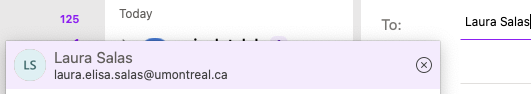
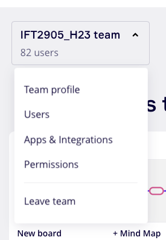
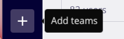
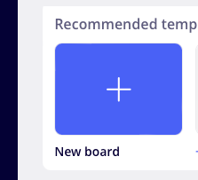
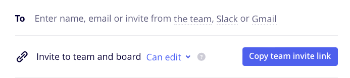

## IFT2905 - Semaine 2  - ✨  Rendre les choses simples pour l'utilisateur ✨  

## Microdevoir 

==Remise SUR **STUDIUM**, à remettre demain (mercredi)==

==L'interface d'exemple doit **<u>obligatoirement</u>** être une page d'inscription==

Ce n'est pas important si votre remise se fait sur le groupe A ou B, la correction des deux groupes se fait ensemble. 

[Lien aux instructions du devoir](https://docs.google.com/document/d/17Fbyqc9pHNQ7bdZ-4qlNbzFidGXX2WEY0MBjzjFFq90/edit?usp=sharing)

==Si vous n'arrivez pas à trouver vos coéquipier.e.s sur les participants de studium, vous pouvez utiliser outlook de l'UdeM pour chercher les courriels des personnes et leur écrire:==

## Instructions pour créer board miro pour votre équipe

Assurez-vous que vous n'êtes pas déjà dans une équipe MIRO avant de créer la votre (vous ne pouvez en créer qu'une avec le plan payant) - si c'est le cas, vous devez partir de l'équipe courante

Créez une nouvelle équipe 

Invitez les membres de l'equipe 

Creez un board pour votre equipe 

Assurez-vous que lorsque vous partagez votre board avec la correctrice,

==Que vous lui donnez les permissions de édit (!!!!)==

## Plan de la démo

> 1. Concepts importants pour aujourd'hui;
> 2. Miyamoto et *Super Mario Bros*: comment bien faire une interface
> 3. Please make it stop: les mauvaises interfaces utilisateurs en logiciel
> 4. Critiquer une interface: comment?
> 5. Miro 
> 6. 👀

****

## Concepts importants pour aujoud'hui 

🇫🇷 🇫🇷 pas du tout la même chose mais donc j'utiliserai les termes en anglais car le français les distingue pas 🇫🇷 🇫🇷 

* **==Efficiency==**

L'utilisateur arrive au résultat final avec **peu d'effort** et/ou dans un délai de **temps considéré comme court** pour la tâche. 

* **==Effectiveness==**

L'interface **permet** à l'utilisateur d'**arriver au résultat final** attendu. 

* **Feedback**

L'interface indique à l'utilisateur que son opération/action a été prise en compte

* **Visibilité**

La **facilité à voir et comprendre** l'**<u>==état==</u>** du système (assurez-vous de bien comprendre la définition d'état de système)

* **Utilisabilité**

Le **degré** auquel un produit peut être utilisé par des utilisateurs spécifiques, pour accomplir des tâches avec efficacité, efficience *et* satisfaction

* **Memorabilité**: 

Capacité de l'utilisateur de pouvoir se rappeler de comment utiliser l'interface sans avoir à se réferer à de l'aide ou de la documentation.

* **Satisfaction**: 

**Comfort** de l'utilisateur + lui faire vivre une **expérience positive** 

* **Simplicité d'apprentissage** 

La **facilité** avec laquelle les utilisateurs **s'habituent et utilisent l'interface**

* **Erreurs** 

Mesure de la quantité de ceux-ci, ainsi que **leur impact**

____

## Miyamoto et *Super Mario Bros*: comment bien faire une interface

<iframe width="80%" height="600px" src="https://www.youtube.com/embed/zRGRJRUWafY?start=26" title="YouTube video player" frameborder="0" allow="accelerometer; autoplay; clipboard-write; encrypted-media; gyroscope; picture-in-picture; web-share" allowfullscreen></iframe>

Efficiency: 2:57 

Effectiveness: - 2:58 

Feedback: les bruits du jeu; les blocs qui s'activent quand on les frappe correctement; les goomba applatis quand arrive à les tuer; les blocs "vides" qui font un petit bruit sec pour indiquer qu'il n'y a rien qui s'active là 

Visibilité du système: 

* l'état de mario

  
  
  
  
  

* Le nombre de vies 
* Où se trouve mario dans le monde, ainsi que ses enemis 
* Le temps restant 
* Le score  

Utilisabilité - 1:41 ; 3:33 

Memorabilité  - 1:15 

Simplicité d'apprentissage - 0:46 

Satisfaction - 0:26; 1:02 

Erreurs  - 2:28 

 

________

## *Please, make it stop*: les mauvaises interfaces utilisateurs

#### [User in yer face (site web) - Ce qu'il ne faut *pas* faire](https://userinyerface.com) 

et pourtant...

<i>Figure 1: laura qui essaye de <a  target="_blank" href="https://identification.umontreal.ca/cas/ChangerMDP.aspx">changer son mot de passe synchro</a>.</i> 

_______

## Critiquer une interface: comment?

Retour à:

[User in yer face (site web) - Ce qu'il ne faut *pas* faire](https://userinyerface.com) 

## Votre tour:

## http://tiny.cc/demomiro

