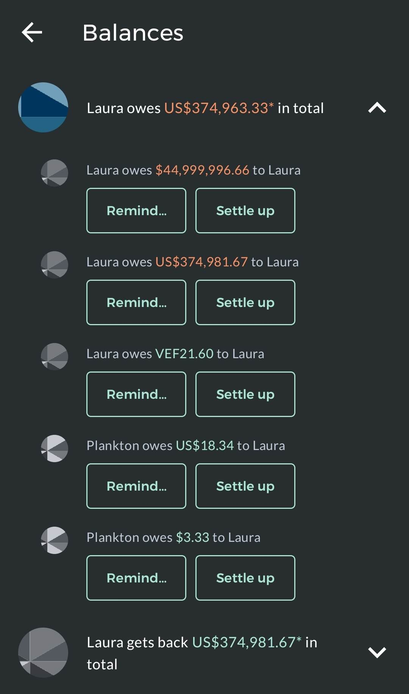

## IFT2905 - Semaine 4  - ✨  L'étudiant.e en IFT2905 qui critique l'interface ✨  

<hr/>

Plan de la démo

```
1. Mini retour sur le(s) minidevoirs
2. Les tâches & les scénarios
3. Démo interactive: Splitwise 
4. 👀 
```


------

 

## Mini retour sur les minidevoirs

À revoir: 

* Différence entre *design* et *fonctionnalité*
* Justifiez vos arguments (!!)
  * Assurez-vous que vous comprenez vraiment le vocabulaire que vous utilisez. 


____


## Les tâches & Scénarios 

### Tâches 

* Actions concrètes que l'on réalise quand on veut accomplir notre but 
* Ne sont *pas* fixées à l'interface telle quelle 
* On fera le retour sur ceci dans notre exemple *Splitwise*

### Scénarios 

* L'on s'imagine un utilisateur réel en train d'utiliser l'interface dans le but d'accomplir ses tâches
* L'on inclut quelques détails sur l'utilisateur: ça nous aide à comprendre avec qui on traite, comment se passera l'interaction de l'interface. Par exemple, l'utilisation de *Whatsapp* sera très différente entre:
  * Ma grand-mère qui utilise *Whatsapp* vs. 
  * Moi qui utilise *Whatsapp*
* L'on inclut des détails sur son interaction avec l'interface
* On fera aussi le retour sur ceci. 


_______

## Étude de cas: Application *Splitwise*

### Avant de poursuivre: fonctionnalité vs. utilisabilité 

* L'utilisabilité est la facilité d'utilisation d'une interface. 

* La fonctionnalité est l'ensemble des opérations prises en charge par une interface. 

> L'utilisabilité et la fonctionnalité sont souvent considérées comme un compromis de conception: 
>
> * Un grand nombre de fonctions dans une interface utilisateur peut être une gêne qui rend les interfaces plus difficiles à apprendre et à utiliser.
> * Enlever trop de fonctions ou les rendre moins "accessibles" rend un interface moins puissant 

[source](https://simplicable.com/design/usability-vs-functionality)

### Splitwise:  le partage d'argent, rendu encore plus compliqué!

[demo en live: les tâches, les scénarios, et puis la réalité...]



Exemple de splitwise*. 

*Les chiffres ne sont pas réels. Une chance que je ne me dois pas 44.9 millions de dollars (même pas sûre si c'est ça le vrai montant!) à moi-même.


____


# 👀
