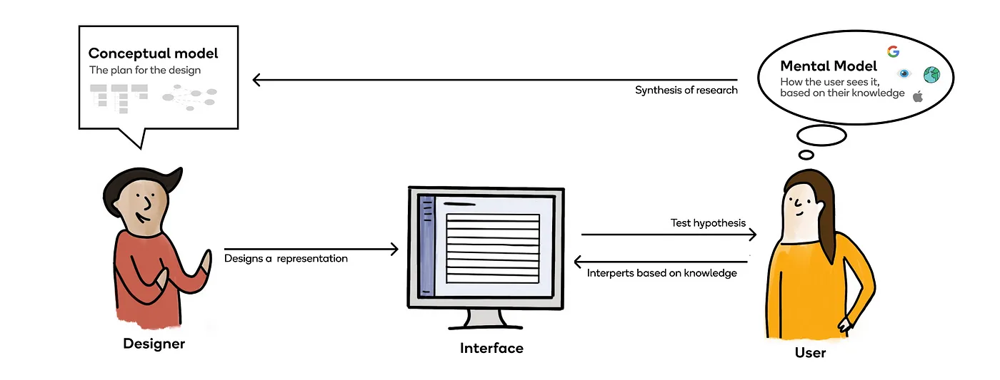
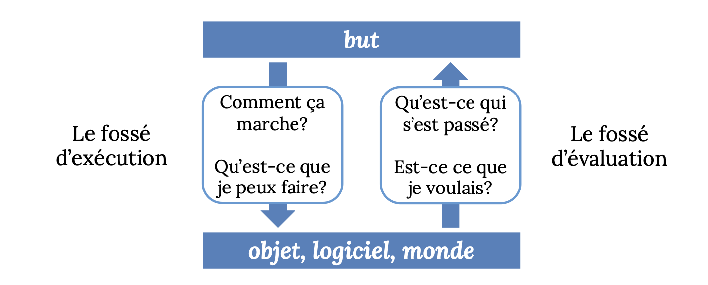

# Semaine 7: Le bébé qui apprend à découvrir le monde autour de lui 👶

## Plan de la démo

> 0. Vidéo drôle: *user testing/focus groups - Silicon Valley*
>
> 1. Les deux fossés d'interaction
> 2. 👀 

##  User testing/focus groups - *Silicon Valley*

<iframe width="60%" height="500px" src="https://www.youtube.com/embed/QYBcLMiR9b0" title="YouTube video player" frameborder="0" allow="accelerometer; autoplay; clipboard-write; encrypted-media; gyroscope; picture-in-picture; web-share" allowfullscreen></iframe>

___

## Quick rappel: Modèle mental vs. modèle conceptuel 

(des slides du prof + de la source de celles-ci)

**Modèle conceptuel: ce que le <u>designer</u> crée**

* ce que les utilisateurs pourront faire

* de quels concepts les utilisateurs auront besoin pour

  interagir

* comment vont-ils interagir avec un système

**Modèle mental: Ce que <u>l'utilisateur</u> a /apprend**

* imagine le fonctionnement du système
* peut aider ou entraver l'interaction des utilisateurs

## Retour sur: les deux fossés de l'interaction

#### Fossé de <u>l'exécution</u>: comprendre comment faire quelque chose

figure 1: Laura qui essaye de faire ses taxes

#### Fossé de <u>l'évaluation</u>: comprendre qu'est-ce qui vient de se passer

figure 2: Laura en 1ère année qui vient d'overwrite son code local après avoir fait une commande sur git qu'elle comprenait pas 

[lien vers les diapos du prof qui parlent de ceci](http://www-labs.iro.umontreal.ca/~bmpix/teaching/2905/2023/lectures/05_DOET1.pdf)

#### Les 7 étapes de l'action de Norman (retour, encore)

[Source de ce contenu ci-dessous](https://uxdesign.cc/ux-psychology-principles-seven-important-questions-960579272880)

> **Légende:** 
>
> **Fossé de l'exécution** 
>
> **Fossé de l'évaluation**

1. **Objectif**: que veux-je accomplir et pourquoi?
2. **Intention**: comment puis-je le faire?
3. **Spécification** : quelles sont mes options?
4. **Exécution** : que puis-je faire maintenant?
5. **Perception** : que vient-il de se passer?
6. **Interprétation** : qu'est-ce que ça signifie?
7. **Évaluation** : est-ce acceptable? Ai-je atteint mon objectif?

#### Exemple:

Utiliser une machine pour payer des tickets de stationnement:

1. **Objectif:** utiliser la machine à tickets pour payer votre place de stationnement

2.  **Intention**: comprendre comment fonctionne la machine à tickets

3.  **Spécification**: sélectionner les actions pour entrer le numéro d'immatriculation de la voiture, insérer le montant requis d'argent et imprimer le ticket

4.  **Exécution**: exécuter physiquement la séquence d'actions spécifiée

5.  **Perception**: observer l'affichage numérique et le ticket imprimé

6.  **Interprétation**: le système a accepté les détails de la voiture et de l'argent... le paiement est réussi.

7.  **Évaluation**: le ticket imprimé vous a bien mené à votre objectif! yay! 

   

___

## 👀
