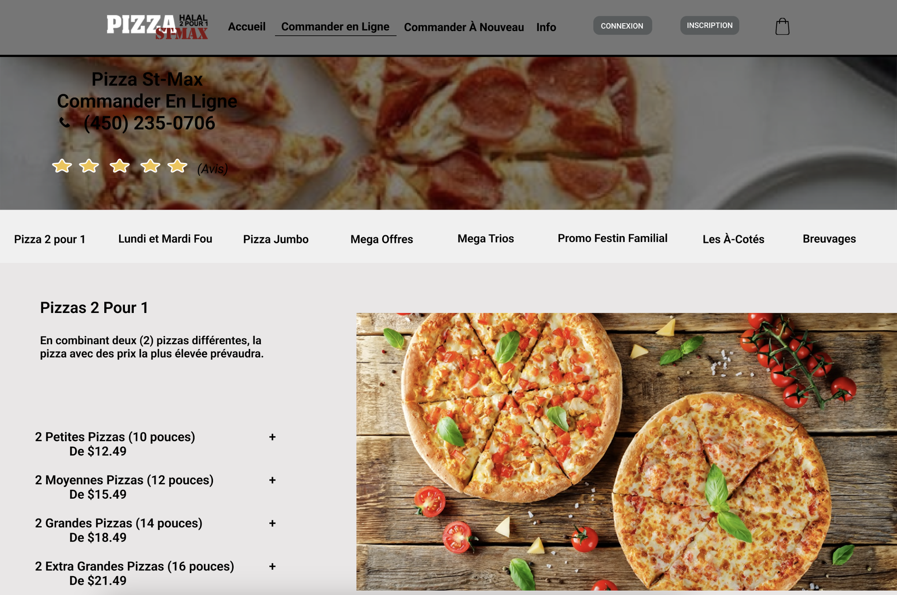
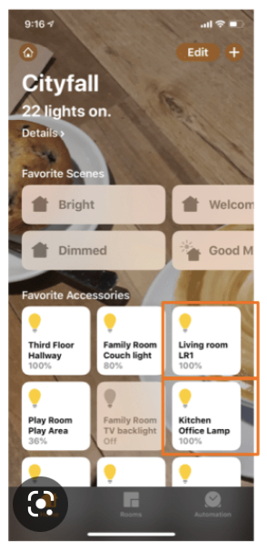
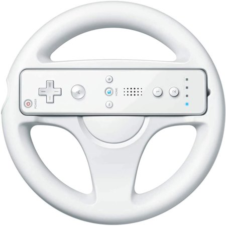
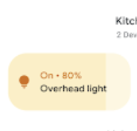
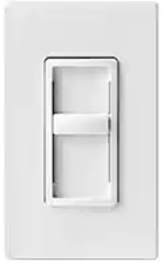

## IFT2905 - Semaine 3  - ✨  L'utilisateur qui navigue l'interface ✨  

<hr/>

# Microdevoir 2 

* Disponible sur studium 
* à remettre le 27 janvier, 23h59 
* L'écran du protoype figma à critiquer est bel et bien le <u>premier</u> écran que l'on voit sur le prototype: 



_____


[Le meilleur achat que vous pourrez faire de votre vie*](https://www.amazon.ca/Design-Everyday-Things-Revised-Expanded/dp/0465050654/ref=sr_1_1?crid=3RQRDAW4EJKQJ&keywords=the+design+of+everyday+things&qid=1674719680&sprefix=the+design+of+ever%2Caps%2C93&sr=8-1)

<span style="font-size: 0.5em;">*nous ne sommes pas affiliés à Don Norman ni à Amazon</span>

## Plan de la démo

> 1. Concepts importants; démo IRL avec switch de lumière et mannette wii;
> 3. 👀

------

 

## Concepts importants 

* **Affordance**

*Capacité d’action qu'un utilisateur peut effectuer avec un objet*

La **relation** **entre l’utilisateur et l’objet** qui déterminent **comment** l’objet peut être **utilisé**

* ***Signifiants*** 

 utilisés pour rendre visible les affordances:

* ils indiquent quelles actions sont possibles, et (*souvent*)

* où et comment ils devraient être appliqués

**Exemple: **

<p><br/> Sur l'interface ci-contre: <br/> <br/> <b>Affordance: </b> le bouton lui-même. Ce n'est <u>PAS</u> le carré blanc qui ressemble au bouton, mais bien l'espace designé dans l'interface qui, lorsque appuyé, va activer l'action reliée à celui-ci.  <br/> <br/> <br/> 
<b>Signifiants: </b> 
   - Le carré blanc servant à designer le bouton qui nous indique qu'on peut appuyer sur cette partie là de l'écran. <br/> 
   - L'ampoule qui indique que c'est bel et bien une lumière que l'on contrôle <br/> 
   - Le <i>label</i> (étiquette?) qui indique la lumière se retrouve dans quelle chambre<br/> 
   - Le pourcentage pour indiquer l'intensité à laquelle la lumière brille. <br/>
    <a href="https://uxdesign.cc/what-is-an-affordance-6b60f2de79f2?gi=d335b98716fe">source</a>
</p> 

**TLDR:** Les signifiants nous aident à rendre une affordance qui n'est pas si apparante à l'utilisateur plus visible. 

​	

* #### Correspondances (mapping)

Une relation logique entre la *dynamique* de contrôle d'une interface et *l'action* ou *résultat* de ce contrôle.

##### Correspondance naturelle

Prendre avantage des analogies au monde physique ou aux standards culturels.

Un exemple: La mannette Wii avec l'accessoire "Volant" pour *Mario Kart Wii*



À réfléchir: 

```
plusieurs personnes ont préferé utiliser l'autre type de contrôle pour contrôler leurs voitures de Mario Kart. Pourquoi?  Est-ce que malgré cela, le contrôle "volant" est plus facile à apprendre? Qui était le public cible de la Wii?
```

Un autre exemple: notre switch de lumière de tantôt: 



correspond à:



Dans l'appli *Google Home*, l'on peut ajuster l'intensité d'une lumière en glissant de gauche à droite dans le bouton de celle-ci, un peu comme un gradateur de lumière (dimmer)


* **Modèles conceptuels**

Une explication, souvent très simplifiée, de la façon dont quelque chose fonctionne.

→ **Un modèle conceptuel n’a *pas* besoin d’être complet ou même précis** **tant qu’il est utile**

Modèle fonctionnel → function: intuition

On sait quoi faire sans savoir pourquoi

Modèle structurel → on connait la structure/les composantes

##### Modèles conceptuels sont formés à travers

* des connaissances et hypothèses préexistantes
* interaction avec l'objet 
* explication


____

# 👀
